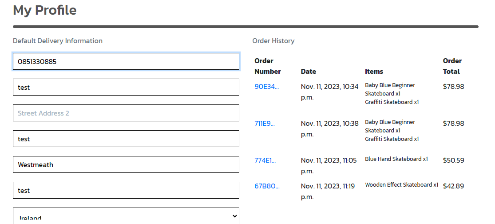
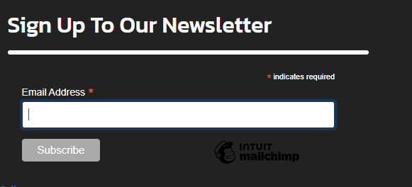

# The Skate Room

The Skate Room is an online store and community for the skaters of Ireland. The skate store sells skateboards, skate apparel and accessories and provides information to users on local events, skate park get togethers and locations of skateparks around Irealnd. The Skate Room is more than an online store, it is a community run by skaters for skaters. The idea is to create a one stop shop for all things skating.

## Strategy

I started my project by outlining my startegy and thinking about my target audience and the features they would need.

The target audience for The Skare Room is

- People aged 18 - 35
- Skateboarders
- People interested in skateboarding
- People interested in skateboard culture and fashion

Users will be looking for

- A place to buy and upgrade their current skating setup
- A place to purchase skating apparel from well known brands
- Information about meet ups, competitions and new skate parks
- Keep up to date with special offers, new events and social gatherings

My website will try to offer users these features in a clean and intuitive way. The design hopes to appeal to the target audience with a cool skate vibe and be a website which is shared around the skate community. My aim is to become a one stop shop for news, competition info, skating apparel and accessories. My website will have to be fully responsive to be available on the go on all device sizes. I will use Bootstrap grids and elements & custom CSS to achieve this.

# Design

The design for this project is based off of skatepark culture and brands such as Converse, Vans and DC. The design I'm going for is a simple look with eye catching event images and a purple main brand colour used troughtout. The font im using for heading is Russo One and the font for the body is Kanit. I got these fonts from Google fonts.

# Features

My online store contains plenty of features to benefit my users and make my site user friendly. The landing page contains the main navigation and user menus along with call to action buttons to visit the store or view events. Further down on the homepage is where the upcoming events are displayed. This is important to be on the homepage as my website isn't primarily an online store it is a community for skaters to get news and updates on events along with being able to update their skating setup in the store.

### Navigation

My main navigation appears just under the site logo and search bar. From this navigation users can access the products on my website as well as the extra skate section to view upcoming events, get in contact or find a skatepark near them. The navigation is styled with bootstrap and uses dropdown menus to access further pages.

<details>
  <summary>Main Nav</summary>

  
  
</details>

### Hero Image

The hero image on my site is the first image the user sees when they access the website. It is an image of the inside of a skateboard shop with an overlay and text saying 'Welcome to the skate room' along with two buttons, one for the products page and one for events. This image sets the tone of the website and lets the user know straight away that it is a skating website.

<details>
  <summary>Hero Image</summary>
  
  

</details>


### Upcoming Events

On the homepage under the hero image is the upcoming events section. This displays the 3 closest events in a bootstrap card with a button to view more details. This will automatically update with new events when they are added to always show the 3 closest ones. The upcoming events heading is also a link to bring the user to the full events page.

<details>
  <summary>Events</summary>

  
  
</details>


### Footer

The footer is simple and contains links to The Skate Room social media and Facebook business page so users can easily follow us on social media and keep up to date with the brand. The footer also contains a sign up form embedded from mailchimp to subscribe to a newsletter about any new upcoming events or special offers. Under this is a link to my privacy policy.

<details>
  <summary>Footer</summary>

  
  
</details>


### Products page

The main products page shows all products on the website and can be sorted by a number of different variables such as price and rating. The products are displayed on bootstrap cards with the price, category, image, name and rating easily visable.

<details>
  <summary>Products</summary>

  
  
</details>


### Product Detail Page

This page is accessed when a user clicks on a product they would like to purchase. This page features a description of the product, an option to select quantity and size and an add to cart button which updates the shopping cart with the product. When an item is out of stock the user will not be able to add it to the bag.

<details>
  <summary>Product Detail</summary>

  
  
</details>


### Product Management

This page is only accessable to logged in admins and it is where new products can be added. The form can be filled out with product details and an image. This then adds the product to the neccessary category.

<details>
  <summary>Product Management</summary>

  
  
</details>


### Local Skate Parks

This page maps out skateparks around Ireland for users to find local skateparks to them. I did this by using Leaflet and plotting the longitude and lattitude of the skateparks into javascript code. This then populated the map with the locations.

<details>
  <summary>Skateparks</summary>

  
  
</details>


### Contact Us

The contact page allows users to get in touch with The Skate Room with any questions or queries and sends and email to us when the form is submitted.

<details>
  <summary>Contact</summary>

  
  
</details>


### Events page

The events page allows users to see all upcoming events displayed on bootstrap cards similar to that of the products. When an event is clicked a user can see more information about the event and a button to register your interest. This button brings the user to a form which they can fill out to register for the event. The form contains a drop down menu for the user to select the event they wish to register for. When submitted this sends an automated email to the skate room with the users details. An admin can also edit or delete events from this page when logged in.

<details>
  <summary>Events</summary>

  

  
  
</details>


### Event Management

This page is only accessable to logged in admins and it is where new events can be added. The form can be filled out with event details and an image to add to the events page.

<details>
  <summary>Mangement</summary>

  
  
</details>

### Comments

This allows logged in users to comment on events. Users can also like other users comments and delete their own comments.

<details>
  <summary>Comments Section</summary>

  
  
</details>

### Shopping bag

Users can add products to their shopping bag to purchase. The shopping bag will show quantity, size and price of item and calculate a grand total

<details>
  <summary>Shopping Bag</summary>

  
  
</details>

### Profile page

Allows users to update their profile information and view their recent order history.

<details>
  <summary>Profile</summary>

  
  
</details>


### Checkout Page

Users can go to checkout with their bag items. A checkout form asking users for their delivery details and card details will show alongside an order summary.

<details>
  <summary>Checkout</summary>

  
  
</details>

## CRUD Functionality

I have implemented CRUD functionality into this project by allowing an admin the ability to fully manage products and events on this website. Admins can add, edit or delete products and events from the admin panel. This allows full control over all content on the website.

This functionality represents the features needed to manage a real world eccommerce website. Product information, price and inventory needs to be kept up to date in order to have a free flowing working website and the product and event management pages allow for this. 

## Agile Methodology

I used GitHub to implement agile methodology into this project by creating user stories in my repository and using these to plan out my project and features to implement based on importance to achive a MVP. I assigned these user stories to larger epics to better manage each feature of the website.


I mapped out my user stories using issues on Github. I gave them a label based on importance and moved them to complete as they were finished. In the end I completed all my user stories for this project.


## MoSCoW Prioritization

I used MoSCow prioritization to prioritze my user stories and make sure to implement the neccessary features. I added labels to my user stories in issues on github to do this

- Must Have: guaranteed to be delivered
- Should Have: adds significant value, but not vital
- Could Have: has small impact if left out
- Won't Have: not a priority for this iteration

## User Stories

My user stories are split into epics, displayed below and also mapped out using agile methodology HERE

### Epic 1 - Core Functionality

- As a user I want to navigate through the site to easily view desired products so I can choose what I would like to purchase.
- As a user I want to be able to easily find a navigation bar and footer so I can view what is available on the website.
- As a user I want to be able to get key information on the landing page without spending too much time searching for what I need.
- As a user I want to be notified about any changes made on the website so I am clear of what is happening.
- As a user I want to be able to access the website on both mobile and desktop devices.

### Epic 2 - Products

- As a user I want to easily view all products available to buy.
- As a user I want to find all relevant information about the product to make an informed purchasing decision.
- As a user I want to be able to use filters to easily identify the most suitable products for me

### Epic 3 - Ordering/Cart

- As a user I want to be able to process orders by making a card to make purchasing a product quick and easy
- As a user I want to preview my current basket incase I want to make changes.
- As a user I want to receive an order confirmation to ensure the order was received.
- As a user I want to be provided with an update when an item is added to my basket to confirm my selection

### Epic 4 - News and Events

- As a user I want to provide my email address to be kept up to date with the latest skating events happening
- As a user I want to be able to easily find upcoming events on the website that I can go to
- As an admin I want to be able to add event information to the website to keep the community up to date with upcoming events.

### Epic 5 - Admin Functionality

- As an admin I want to be able to see the product management page so I can make changes to front end
- As an admin I want to add, remove or edit products on page to accurately represent the items being sold

### Epic 6 - User Accounts

- As a user I want to register and login so I can view my orders
- As a user I want to easily be able to log in and log out of my account
- As a user I want to save my default shipping address to save time on my next purchase
- As a user I want to easily add, edit or remove my profile information to keep it up to date and accurate
- As a user I want to join in on the conversation and be able to add comments and interact with users

### Epic 7 - Marketing

- As a user I want to sign up for a newsletter to keep up to date with newest styles, sales and events.
- As an admin I want to creat a facebook business page so users can follow us on social media and create a community
- As an admin I want to add keywords and utilised SEO to increase website traffic and ranking.


## Models Used

I used a variety of models in my project. Both custom models and models from the Boutique Ado walkthrough project. Below are all my models represented in a table

### Product Model

| Field Name   | Field Type           | Description                                          |
|--------------|----------------------|------------------------------------------------------|
| id           | AutoField            | Primary key                                          |
| category     | ForeignKey(Category) | Reference to the Category model (nullable)           |
| sku          | CharField(254)       | Stock Keeping Unit, a unique identifier (nullable)   |
| name         | CharField(254)       | Name of the product                                  |
| description  | TextField            | Description of the product                           |
| has_sizes    | BooleanField         | Indicates whether the product has different sizes    |
| size         | CharField(10)        | Size of the product (default: 'Medium')              |
| stock        | IntegerField         | Available stock quantity                             |
| price        | DecimalField         | Price of the product                                 |
| rating       | DecimalField         | Rating of the product (nullable)                     |
| image_url    | URLField             | URL for the product image (nullable)                 |
| image        | ImageField           | Image file for the product (nullable)                |


### Event Model

| Field Name   | Field Type          | Description                                      |
|--------------|---------------------|--------------------------------------------------|
| id           | AutoField           | Primary key                                      |
| title        | CharField(200)      | Title of the event                               |
| description  | TextField           | Description of the event                         |
| date         | DateField           | Date of the event                                |
| time         | TimeField           | Time of the event (nullable, default=None)      |
| image        | ImageField          | Image associated with the event (upload to 'event_images/') |


### Order Model

| Field Name        | Field Type                 | Description                                        |
|-------------------|----------------------------|----------------------------------------------------|
| id                | AutoField                  | Primary key                                        |
| order_number      | CharField(32)              | Unique order identifier (not editable)             |
| user_profile      | ForeignKey(UserProfile)    | Reference to the UserProfile model (nullable)     |
| full_name         | CharField(50)              | Full name of the customer                         |
| email             | EmailField(254)            | Email address of the customer                      |
| phone_number      | CharField(20)              | Phone number of the customer                       |
| country           | CountryField               | Country of the customer                           |
| postcode          | CharField(20)              | Postal code of the customer (nullable)             |
| town_or_city      | CharField(40)              | Town or city of the customer                       |
| street_address1   | CharField(80)              | First line of street address                       |
| street_address2   | CharField(80) (nullable)   | Second line of street address (nullable)           |
| county            | CharField(80) (nullable)   | County of the customer (nullable)                  |
| date              | DateTimeField(auto_now_add)| Date and time of order creation (auto-generated)   |
| delivery_cost     | DecimalField(6, 2)         | Cost of delivery                                   |
| order_total       | DecimalField(10, 2)        | Total cost of the order                            |
| grand_total       | DecimalField(10, 2)        | Grand total cost including delivery                |
| original_bag      | TextField                  | Serialized data of the original bag contents       |
| stripe_pid        | CharField(254)             | Payment intent identifier from Stripe              |


### Order line item model

| Field Name        | Field Type                  | Description                                           |
|-------------------|-----------------------------|-------------------------------------------------------|
| id                | AutoField                   | Primary key                                           |
| order             | ForeignKey(Order)           | Reference to the Order model (not nullable)           |
| product           | ForeignKey(Product)         | Reference to the Product model (not nullable)         |
| product_size      | CharField(2) (nullable)      | Size of the product (e.g., XS, S, M, L, XL)            |
| quantity          | IntegerField                | Quantity of the product in the order (not nullable)   |
| lineitem_total    | DecimalField(6, 2)          | Total cost of the line item (auto-generated, not editable) |


### Comment Model

| Field Name        | Field Type                  | Description                                           |
|-------------------|-----------------------------|-------------------------------------------------------|
| id                | AutoField                   | Primary key                                           |
| event             | ForeignKey(Event)           | Reference to the Event model (cascading delete)       |
| user              | ForeignKey(UserProfile)     | Reference to the UserProfile model (cascading delete) |
| text              | TextField                   | The content of the comment                             |
| created_at        | DateTimeField(auto_now_add) | Date and time when the comment was created             |
| likes             | ManyToManyField(User)        | Users who liked the comment (related_name: 'liked_comments') |

### Category Model

| Field Name    | Field Type          | Description                                    |
|---------------|---------------------|------------------------------------------------|
| id            | AutoField           | Primary key                                    |
| name          | CharField(254)      | The name of the category                       |
| friendly_name | CharField(254)      | A user-friendly name for the category          |

### User Profile Model

| Field Name             | Field Type          | Description                                        |
|------------------------|---------------------|----------------------------------------------------|
| id                     | AutoField           | Primary key                                        |
| user                   | OneToOneField(User) | Reference to the associated user                   |
| default_phone_number   | CharField(20)       | Default phone number for delivery information      |
| default_street_address1| CharField(80)       | Default first line of street address               |
| default_street_address2| CharField(80)       | Default second line of street address (optional)   |
| default_town_or_city   | CharField(40)       | Default town or city for delivery information      |
| default_county         | CharField(80)       | Default county for delivery information (optional) |
| default_postcode       | CharField(20)       | Default postcode for delivery information          |
| default_country        | CountryField        | Default country for delivery information (optional) |


## SEO & Marketing

### SEO

To aid in SEO for my business, I have included meta descriptions and keywords in the page header. I have also included a robots.txt file and a sitemap.xml file to aid in seach engines scraping my website. I have also used h1 and h2 headings with keywords and included keywords in product names and descriptions and event names and descriptions.


### Marketing

To aid with digital marketing for my website I have set up a Facebook business page that is linked in the footer of the website. This allows my users to keep up to date with the company on social media and for my business to appeal to a larger audience base


I also added a newsletter signup form in the footer of my website. This form is embeded from Mailchimp and allows users to submit their email address to keep up to date with the latest news, events and special offers.



## Tools & Technologies Used

- [HTML](https://en.wikipedia.org/wiki/HTML) used for the main site content.
- [CSS](https://en.wikipedia.org/wiki/CSS) used for the main site design and layout.
- [Bootstrap](https://getbootstrap.com/) used as the front-end CSS framework for modern responsiveness and pre-built components like forms, rows and columns.
- [JavaScript](https://www.javascript.com/) used to populate menu items onto main page and display Google maps API.
- [Python](https://www.python.org/) used as the back-end programming language.
- [Git](https://git-scm.com/) used for version control. (git add, git commit, git push)
- [GitHub](https://github.com/)used for secure online code storage.
- [Codeanywhere](https://app.codeanywhere.com/) used as a cloud-based IDE for development.
- [Django](https://www.djangoproject.com/) used as the Python framework for the site.
- [PostgreSQL](https://www.postgresql.org/) used as the relational database management.
- [ElephantSQL](https://www.elephantsql.com/) used as the Postgres database.
- [Heroku](https://www.heroku.com/) used for hosting the deployed back-end site.
- [Amazon Web Services](https://aws.amazon.com/free/?trk=e747cc26-a307-4ae0-981a-6dc5c1cb4121&sc_channel=ps&ef_id=CjwKCAiA3aeqBhBzEiwAxFiOBmiu8xFBH9IvqKB-2wBMY_Wofr2lvZHKx9SM24yUNUuGBm7Y8XuhZxoCTPMQAvD_BwE:G:s&s_kwcid=AL!4422!3!453053794221!e!!g!!amazon%20aws!10705896207!102406403021) used for online static file storage.
- [Gmail](https://www.google.com/gmail/about/) used to create send and recieve emails from users.

## Testing

My testing can be found in [testing.md](https://skate-room-fa0d77babcb9.herokuapp.com/)

## Deployment

My app is found deployed on Heroku. [Deployed site](https://skate-room-fa0d77babcb9.herokuapp.com/)

### ElephantSQL Database

This app uses ElephantSQL for the PostgreSQL Database.

To obtain your own Postgres Database, sign-up with your GitHub account, then follow the steps below:

- Click Create New Instance to start a new database.
- Provide a name, usually your project name
- Select the free Tiny Turtle plan.
- Select the Region and Data Center closest to you.
- Now click on your new database name, where you can view the database URL and Password.

### Amazon Web Services

I used Amazon web services for static files storage. 

- Create a free AWS account.
- Add S3 and IAM services to your account
- In S3 create a new bucket with name of project
- In IAM create new User Group.
- Create a policy
- Attach the policy

### Heroku Deployment

This app is deployed to [Heroku](https://heroku.com). After account set up follow the deployment steps below

- Select create a new app from the dropdown menu on your Heroku Dashboard
- Your app name must be unique, and then choose a region closest to you, then select Create App.
- From your app Settings, click Reveal Config Vars, and set your environment variables.

| Config vars | Description |
| ----------- | ----------- |
| DATABASE_URL | Insert your own ElephantSQL database URL here |
| DISABLE_COLLECTSTATIC  | 1 (this is temporary, and can be removed for the final deployment)|
| SECRET_KEY | This can be any random secret key |
| EMAIL_HOST_USER | This is to send emails in my app using Gmail. This will be the email address |
| EMAIL_HOST_PASS | This is the password for the email address to allow django to send emails |
| STRIPE_PUBLIC_KEY | This is the public key neccessary for stripe payments |
| STRIPE_SECRET_KEY | This is the secret key neccessary for stripe payments. (important to keep secret) |

Heroku also needs two additional files in order to deploy properly.
> requirements.txt

> Procfile

You can install this project's requirements using:
> pip3 install -r requirements.txt
  
If you require additional packages that have been installed, then the requirements file needs updated using
> pip3 freeze --local > requirements.txt

The Procfile can be created with the following command:
> echo web: gunicorn app_name.wsgi > Procfile

replace app_name with the name of your primary Django app name

For Heroku deployment, follow these steps to connect your own GitHub repository to the newly created app:

#### Automatic Deployment

Select Automatic Deployment from the Heroku app.

#### Manual Deployment

- In the Terminal/CLI, connect to Heroku using this command: heroku login -i
- Set the remote for Heroku: heroku git:remote -a app_name (replace app_name with your app name)
- After performing the standard Git add, commit, and push to GitHub, you can now type: git push heroku main

The project should now be connected and deployed to Heroku!

## Local Deployment

This project can be cloned or forked in order to make a local copy on your own system.

For either method, you will need to install any applicable packages found within the requirements.txt file.

- pip3 install -r requirements.txt.
- You will need to create environment varibales file called env.py at the root-level, and include the same environment variables listed from the Heroku deployment steps. Make sure to include this in your .gitignore file

Sample env.py file:

```
import os

os.environ.setdefault("CLOUDINARY_URL", "insert your own Cloudinary API key here")
os.environ.setdefault("DATABASE_URL", "insert your own ElephantSQL database URL here")
os.environ.setdefault("SECRET_KEY", "this can be any random secret key")
os.environ.setdefault("STRIPE_SECRET_KEY", "this is available on stripes developer section on your account")
os.environ.setdefault("STRIPE_PUBLIC_KEY", "this is available on stripes developer section on your account")


```

Once the project is cloned or forked, in order to run it locally, you'll need to follow these steps:

1. Start the Django app: python3 manage.py runserver
2. Stop the app once it's loaded: CTRL+C or ⌘+C (Mac)
3. Make any necessary migrations: python3 manage.py makemigrations
4. Migrate the data to the database: python3 manage.py migrate
5. Create a superuser: python3 manage.py createsuperuser
6. Everything should be ready now, so run the Django app again: python3 manage.py runserver

#### Cloning

You can clone the repository by following these steps:

1. Go to the GitHub repository
2. Locate the Code button above the list of files and click it
3. Select if you prefer to clone using HTTPS, SSH, or GitHub CLI and click the copy button to copy the URL to your clipboard
4. Open Git Bash or Terminal
5. Change the current working directory to the one where you want the cloned directory
6. In your IDE Terminal, type the following command to clone my repository:
git clone <https://github.com/mickdowling16/theskateroom>
7. Press Enter to create your local clone.

#### Forking

By forking the GitHub Repository, we make a copy of the original repository on our GitHub account to view and/or make changes without affecting the original owner's repository. You can fork this repository by using the following steps:

1. Log in to GitHub and locate my GitHub Repository
2. At the top of the Repository just above the "Settings" Button on the menu, locate the "Fork" Button.
3. Once clicked, you should now have a copy of the original repository in your own GitHub account!

## Credits

During the building of my Django app I used a number of different resources to help me complete my project. Below they are all referenced

- Code institue Boutique Ado walkthrough project. This project was the base of my website. It was key to my understanding of building a eccommerce site and I've taken lots of code from this project. I have added my own features and styles to make it my own but this was a big help during the build
- The [Django Documentation](https://docs.djangoproject.com/en/4.2/) helped guide me through issues with setting up my views and models in the early part of my project development.
- The [Codemy.com](https://www.youtube.com/@Codemycom) Youtube channel was a great resource to help me understand adding a comments app for my events. I found his videos very informative and easy to follow.
- The [Django Cheatsheet](https://cheatography.com/lewiseason/cheat-sheets/django-models/) helped me with the terminology for making my models
- I found Dennis Ivy's YouTube Channel very good for walkthroughs and tutorials and to just understand Django more. His walkthrough series on eccomerce websites was helpful [Walkthrough](https://www.youtube.com/watch?v=_ELCMngbM0E&list=PL-51WBLyFTg0omnamUjL1TCVov7yDTRng)
- I found this video very helpful when trying to figure out how to implement my local skateparks map [Leaflet tutorial](https://www.youtube.com/watch?v=E2bhoCOMlsA)
