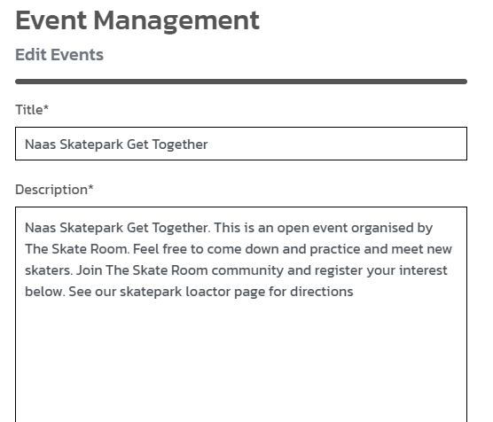

# HTML Testing

# CSS Testing

To test my CSS file I used [CSS Jigsaw Validator](https://jigsaw.w3.org/css-validator/validator). I copy and pasted my base CSS file into the validator and it returned a couple of errors.

After I fixed these my base.css code passed

I also tested my checkout.css file. This passed first time

# JavaScript Testing

I passed my JS code through [JSHint Code Validator](https://jshint.com/). Below are the results.

My stripe elements js file only had one unused variable. This is the stripe variable that came direclty from the documentation so I left this unchanged as I didn't want to risk breaking by stripe functionality

The next JS I passed through JSHint was that for my comments section. The only issue was with one line. I tried to fix this error but couldn't get rid of the errors. It seems its an error with the way the template literal is formatted. I decided to leave this in as my comments section works as expected and I didn't want to risk breaking funtionality so close to project submission

The next JS element I tested was the skateparks map JS. Below is the results, with just one undefined variable, which is from Leaflet library which is defined externally.

# Python Testing

Went through each python file and fixed until no errors were reported in problems terminal. Only issue is line length, but when I tried to fix this it caused more errors in the way the code was read and stopped some of my views from working. Since this was the only errors showing I decided to leave the line length alone as no other problems were showing.

# Manual Testing

1. Main Nav: tested all links on main nav and accessed all pages through the main nav bar. PASSED
2. Search: Tested search functionality and searched for keywords in product name and description. PASSED
3. Log in and out: Tested log in and out function to be able to log into account and then log out of your account. Passed
4. Account registeration: Successfully registered for a new account by filling out registration form.
5. Validate email page: email to validate email address sent. PASSED
6. Product Details: Click each product to show product details page with description, price and add to bag button. PASSED
7. Out of stock: Cannot add out of stock items to bag. PASSED

8. Add to bag: Can add in stock items to bag and shopping bag updates with item and bag total. PASSED

9. Update stock levels: When item added to bag stock levels adjust. PASSED

10. Remove items from bag: Click remove button on item in bag and item is removed from the shopping bag. PASSED
11. Product Management: Product can be edited by a superuser by clicking the edit button on product card. PASSED
12. Product Info Populates: Produt information populates the form and admins can edit products. PASSED

13. Delete product: Superuser can permenently delete products from website. PASSED
14. Event management: Superusers can add events when logged in straight from the front end. PASSED
15. Edit event: Superusers can edit events from the events detail page. PASSED

16. Delete Event: Superusers can permenently delete events. PASSED
17. Register for event: Users can fill out registration form and submit details to admin. PASSED

18. Contact form: Users can fill out contact form, form will be submitted and admin will get an email with form contents. PASSED

19. Purchase product: Add products to shopping bag, proceed to checkout, enter details, checkout securely. PASSED

20. Confirmation email: Customer recieves confirmation email after checkout process. PASSED

21. Order history: Customer order history will appear on their profile after ordering. PASSED

22. Newsletter: Users can sign up to be part of our mailing list. PASSED

23. Social Media: Social media icons open up in new tab. Facebook business page connected. PASSED

24. Update profile: Fill out form on profile page to update profile information. PASSED
25. Local Skateparks: Click locations to bring user to that point on the map: PASSED
26. Privacy policy: Click privacy policy link in footer to bring me to privacy policy page. PASSED

## Browser Compatibility

I tested my site on Chrome, Firefox and Microsoft Edge. All browsers worked as expected with no errors and no differences

## Responsiveness

When testing responsiveness I used my laptop, phone and tablet along with Google developer tools to test the app on different screen sizes. I styles my app with bootstrap to account for smaller screen sizes and for it to be responsive on mobile and tablet. It works as expected on these different screen sizes.

### Mobile

### Tablet

## Lighthouse Testing
